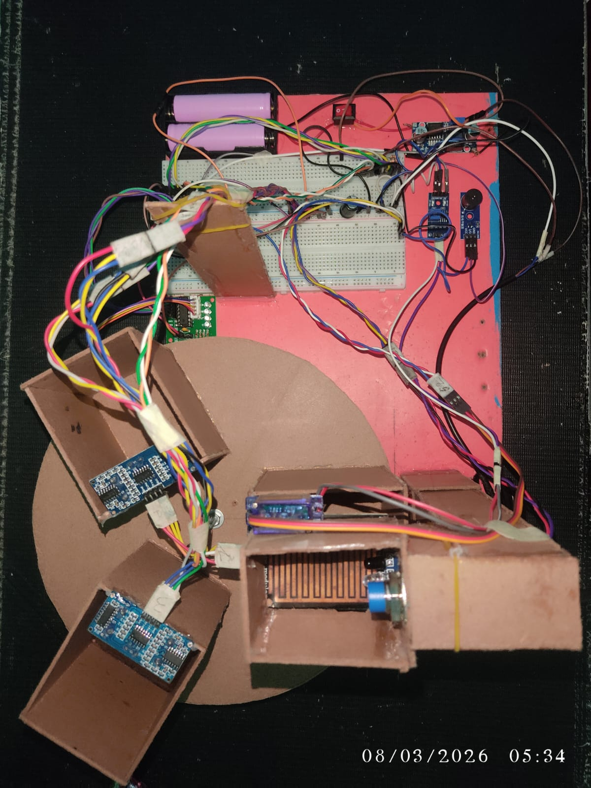
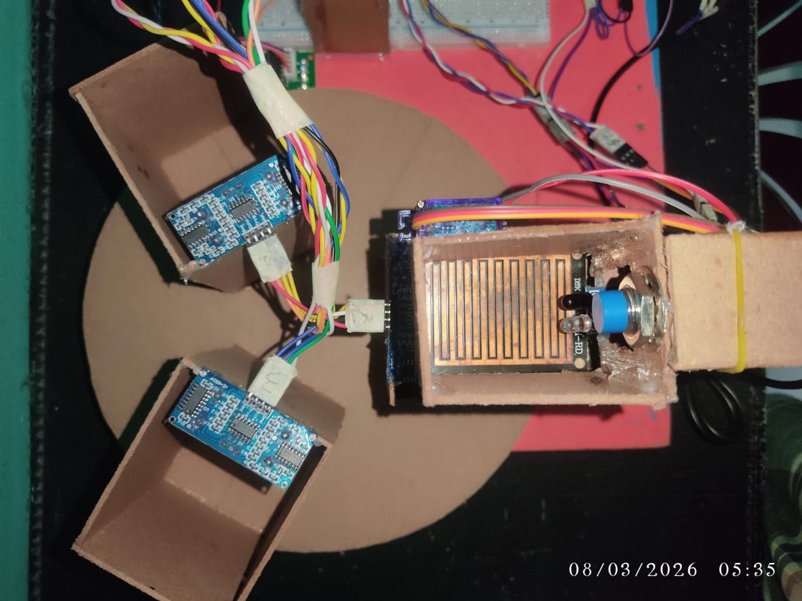
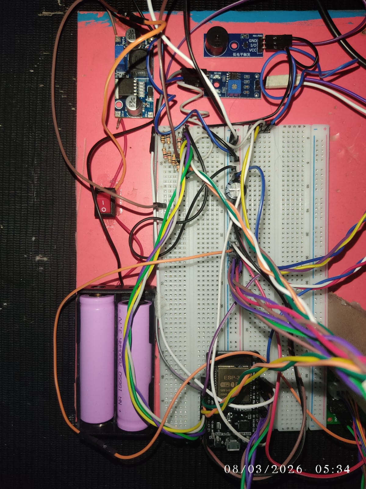
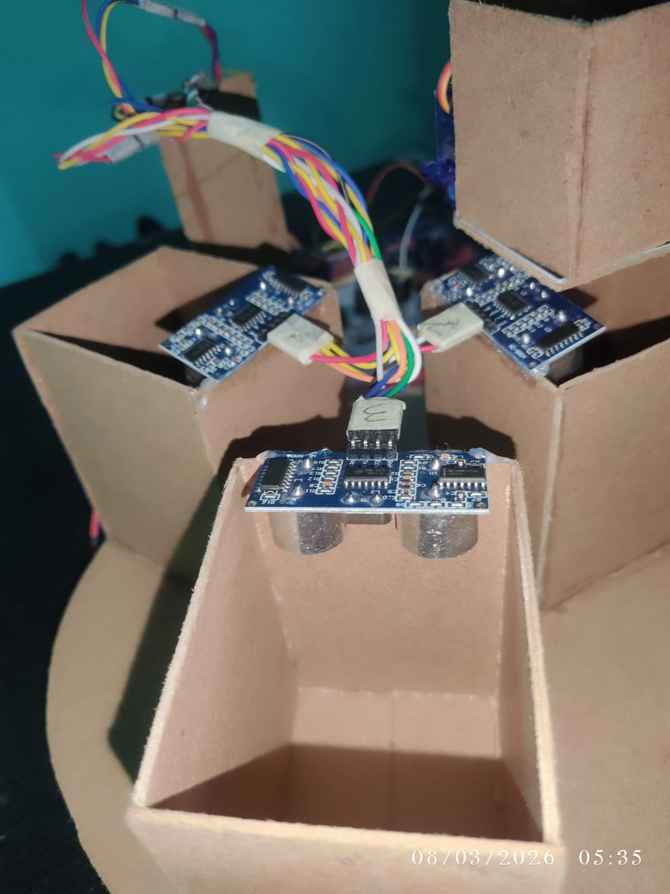
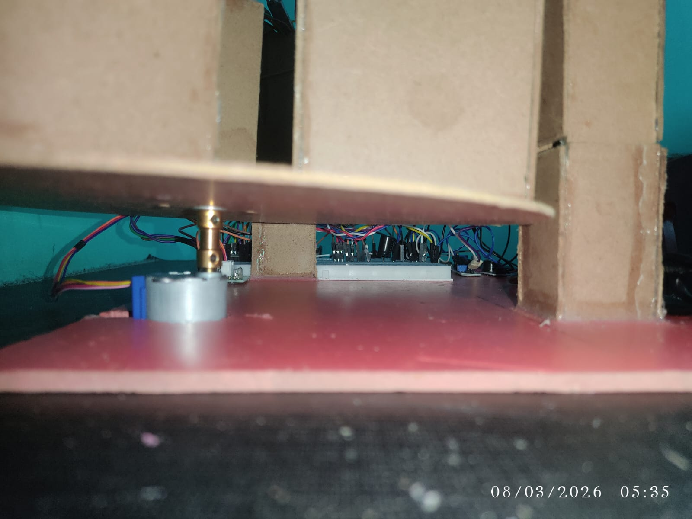

<div align="center">


<br/>


<br/><br/>


<br/><br/>

> ### 🌍 *Automatically classifies and routes waste into wet, dry, and metal bins*
> ### ☁️ *Real-time cloud monitoring via ThingSpeak*

<br/>

---

</div>

## 📝 Project Description

This project implements an **autonomous waste sorting mechanism** that detects
incoming waste, classifies it using inductive metal detection and moisture
sensing, and directs it to the appropriate bin using a stepper motor and
servo-controlled gate.

Bin fill levels are monitored in real time with ultrasonic sensors, and data
is uploaded to **ThingSpeak** for remote monitoring and alerting.

<details>
<summary>🔍 <b>Click to read more...</b></summary>
<br/>

The system is designed for smart city and campus waste management applications.
It eliminates the need for manual waste sorting by automatically detecting
whether waste is wet (organic), dry (recyclable), or metal — and routing it
to the correct bin without any human intervention.

The ESP32 microcontroller handles all logic, WiFi connectivity, sensor reading,
and motor control simultaneously. ThingSpeak provides a free IoT cloud dashboard
for monitoring bin levels remotely from any device.

The system runs on a dual power setup — USB/power bank for ESP32 and sensors,
and a 2S 18650 battery pack with buck converter for the inductive metal detector
which requires higher voltage.

</details>

---

## 🌟 Features

| Feature | Description |
|---------|-------------|
| 📶 **WiFi + ThingSpeak IoT** | Uploads bin levels and alarm status every 15 seconds |
| 🗑️ **Three-bin sorting** | Wet, dry, and metal waste with automatic classification |
| ⚙️ **Stepper motor sorter** | Rotates to target bin (120° wet, 240° metal) |
| 🚪 **Servo gate** | Opens/closes to drop waste into selected bin |
| 📡 **Ultrasonic bin sensors** | Fill level (0–100%) with median-of-3 filtering |
| 💧 **Rain/moisture sensor** | Analog sensor distinguishes wet vs dry waste |
| 🔩 **Inductive metal detector** | Highest-priority NPN NO proximity sensor |
| 🔔 **Active buzzer alarm** | Beeps 3× when bin exceeds 55% fill threshold |
| 🔄 **WiFi auto-reconnect** | Reconnects automatically if WiFi drops |
| 🧠 **Smart metal memory** | Remembers metal detection for 2 seconds after sensor passes |
| ⚡ **Buck converter power** | Stable regulated voltage for all components |

---

## 🏗️ System Architecture
```
                    ┌─────────────┐
    Waste Input ──► │  IR Sensor  │
                    └──────┬──────┘
                           │ object detected
                    ┌──────▼──────┐
                    │  ESP32 MCU  │◄──── WiFi ────► ThingSpeak ☁️
                    └──────┬──────┘
              ┌────────────┼────────────┐
              ▼            ▼            ▼
        Inductive      Rain Sensor   Ultrasonic x3
        Proximity      (GPIO 35)     (fill level)
        Sensor
        (GPIO 13)
              │            │
              ▼            ▼
         ┌──────────────────────┐
         │    Stepper Motor     │
         │    (Route Selector)  │
         │   0°=DRY 120°=WET    │
         │      240°=METAL      │
         └───────────┬──────────┘
                     │
         ┌───────────▼──────────┐
         │     Servo Gate       │
         │  (opens to drop item)│
         └───────────┬──────────┘
               ┌─────┼─────┐
               ▼     ▼     ▼
            💧 WET 📦 DRY 🔩 METAL
```

---

## 🔧 Hardware Components

| # | Component | Model | Purpose |
|---|-----------|-------|---------|
| 1 | 🧠 ESP32 Dev Board | ESP-32S 30P NodeMCU | Main microcontroller + WiFi |
| 2 | ⚙️ Stepper Motor + Driver | 28BYJ-48 + ULN2003 | Rotating sorter mechanism |
| 3 | 🔄 Servo Motor | SG90 180° | Gate open/close control |
| 4 | 📡 Ultrasonic Sensor ×3 | HC-SR04 | Bin fill level sensing |
| 5 | 👁️ IR Obstacle Sensor | IR Sensor Module | Object detection at input |
| 6 | 🔩 Inductive Proximity Sensor | LJ12A3-4-Z/BX NPN NO M12 | Metal vs non-metal detection |
| 7 | 💧 Rain/Moisture Sensor | Rain & Steam Module | Wet vs dry classification |
| 8 | 🔔 Active Buzzer | Active Buzzer Module | Fill-level alarm |
| 9 | ⚡ Buck Converter | HW-411A LM2596 3A | Step-down voltage regulator |
| 10 | 🔋 Battery Holder | 2S 18650 Holder | Battery pack housing |
| 11 | 🔋 18650 Battery ×2 | 3.7V Solderable | Power supply cells |
| 12 | 🔘 Rocker Switch | KCD11 Mini Red | Main power on/off switch |
| 13 | 🧪 Breadboard | Full Size 830 Tie Points | Circuit prototyping |
| 14 | 🔌 Jumper Wires | Male/Female/M-M | Component connections |
| 15 | 🔧 Motor Shaft | — | Mechanical coupling |
| 16 | 🗑️ 3× Bins | — | Wet, dry, metal containers |

---

## 🧩 Pin Connections

| Component | GPIO | Notes |
|-----------|------|-------|
| **⚙️ Stepper IN1** | 4 | Coil 1 — ULN2003 IN1 |
| **⚙️ Stepper IN2** | 2 | Coil 2 — ULN2003 IN2 |
| **⚙️ Stepper IN3** | 18 | Coil 3 — ULN2003 IN3 |
| **⚙️ Stepper IN4** | 19 | Coil 4 — ULN2003 IN4 |
| **🔄 Servo Signal** | 23 | PWM output |
| **👁️ IR Sensor OUT** | 32 | Object present = LOW |
| **🔩 Inductive Sensor OUT** | 13 | Metal detected = LOW (NPN NO) |
| **💧 Rain Sensor AO** | 35 | Analog input-only pin |
| **🔔 Buzzer** | 21 | Active-low (LOW = ON) |
| **📡 Ultrasonic Wet TRIG** | 26 | Wet bin trigger |
| **📡 Ultrasonic Wet ECHO** | 12 | Wet bin echo |
| **📡 Ultrasonic Dry TRIG** | 25 | Dry bin trigger |
| **📡 Ultrasonic Dry ECHO** | 14 | Dry bin echo |
| **📡 Ultrasonic Metal TRIG** | 33 | Metal bin trigger |
| **📡 Ultrasonic Metal ECHO** | 27 | Metal bin echo |

---

> ⚡ [Full Wiring Instructions](Full_Wiring.html)

---

## ⚡ Power Setup
```
╔══════════════════════════════════════════════╗
║   USB / Laptop (5V)                          ║
║         │                                    ║
║         └──► ESP32 NodeMCU (via USB port)    ║
║              │                               ║
║              ├──► 28BYJ-48 Stepper + ULN2003 ║
║              ├──► SG90 Servo                 ║
║              ├──► HC-SR04 Ultrasonic ×3      ║
║              ├──► IR Obstacle Sensor         ║
║              ├──► Rain/Steam Sensor          ║
║              └──► Active Buzzer              ║
╠══════════════════════════════════════════════╣
║   2S 18650 Battery Pack (7.4V)               ║
║         │                                    ║
║         ├──► LM2596 Buck Converter           ║
║         │    └──► 5V rail (optional backup)  ║
║         │                                    ║
║         └──► Direct to Inductive Sensor VCC  ║
║              (LJ12A3 needs 6-36V)            ║
║              Sensor GND ──► ESP32 GND ✅     ║
╠══════════════════════════════════════════════╣
║   KCD11 Rocker Switch — Main Power On/Off    ║
╚══════════════════════════════════════════════╝
```

> ⚠️ **Critical:** Inductive sensor GND and ESP32 GND **must share
> common ground** for correct signal reading on GPIO 13.

> ⚠️ **Voltage Divider Required:** Sensor output is 12V — use
> 20kΩ + 10kΩ voltage divider before GPIO 13 to bring it down to ~3V.

---

## 📚 Libraries Required

Install via Arduino IDE **Library Manager**
(`Sketch` → `Include Library` → `Manage Libraries`):

| Library | Install Name | Purpose |
|---------|-------------|---------|
| `WiFi` | *(Built-in ESP32)* | WiFi connectivity |
| `HTTPClient` | *(Built-in ESP32)* | HTTP requests to ThingSpeak |
| `ESP32Servo` | `ESP32Servo` | Servo control on ESP32 |
| `CheapStepper` | `CheapStepper` | 28BYJ-48 stepper control |

---

## 🚀 Setup Instructions

<details>
<summary>1️⃣ <b>Hardware Assembly</b></summary>
<br/>

- Wire all components per the pin table above
- Connect inductive sensor to 2S 18650 battery pack (7.4V)
- Add **20kΩ + 10kΩ voltage divider** between sensor OUT and GPIO 13
- Connect sensor GND to ESP32 GND (common ground!)
- Connect everything else to USB power via ESP32
- Mount HC-SR04 sensors **above each bin facing straight down**
- Add KCD11 rocker switch on battery positive line for easy power control

</details>

<details>
<summary>2️⃣ <b>Software Setup</b></summary>
<br/>

- Open `Smart_dustbin_2.ino` in **Arduino IDE**
- Go to `Tools` → `Board` → Select **ESP32 Dev Module**
- Go to `Tools` → `Port` → Select correct **COM port**
- Install all required libraries listed above

</details>

<details>
<summary>3️⃣ <b>Configuration</b></summary>
<br/>

Set your WiFi credentials:
```cpp
const char* ssid     = "YOUR_SSID";
const char* password = "YOUR_PASSWORD";
```

Set your ThingSpeak Write API key:
```cpp
String tsApiKey = "YOUR_THINGSPEAK_API_KEY";
```

Tune for your physical bin size:
```cpp
const int BIN_EMPTY_CM       = 7;    // distance (cm) when bin is empty
const int FULL_THRESHOLD_PCT = 55;   // alarm trigger at 55% full
const int RAIN_WET_ON        = 3000; // moisture wet threshold
const int RAIN_WET_OFF       = 3200; // moisture dry threshold
```

</details>

<details>
<summary>4️⃣ <b>ThingSpeak Setup</b></summary>
<br/>

- Create a free channel at [thingspeak.com](https://thingspeak.com)
- Configure fields:

| Field | Data | Unit |
|-------|------|------|
| Field 1 | Dry bin level | % |
| Field 2 | Wet bin level | % |
| Field 3 | Metal bin level | % |
| Field 4 | Alarm status | 0 or 1 |

- Copy the **Write API Key** into the sketch

</details>

<details>
<summary>5️⃣ <b>Upload & Run</b></summary>
<br/>

- Click **Upload** in Arduino IDE
- Open **Serial Monitor** at `115200 baud`
- Confirm WiFi connection message
- Confirm ThingSpeak response code **200**
- Flip the KCD11 rocker switch to power on battery side
- Test by placing objects in the bin input

</details>

---

## ⚙️ How It Works

### 1. 👁️ Object Detection
IR obstacle sensor at bin input detects waste.
When signal goes **LOW** → sort cycle begins.

### 2. 🧠 Smart Classification
```
Object detected by IR sensor
           │
           ▼
  Metal flag set within          ──YES──► 🔩 METAL bin
  last 2 seconds?
  (Inductive sensor NPN NO)
           │ NO
           ▼
  Rain sensor reading             ──YES──► 💧 WET bin
  below wet threshold?
           │ NO
           ▼
                                           📦 DRY bin
```

> 💡 **Metal Memory System:** The inductive proximity sensor (LJ12A3)
> is mounted at the **top** of the bin, IR sensor at the **bottom**.
> When a metal object passes the top sensor, a flag is set for 2 seconds
> — so by the time IR triggers at the bottom, metal is still correctly
> identified and routed.

### 3. ⚙️ Sorting Sequence
```
1. Stepper motor rotates CW to target position:
   - Dry   →   0° (home position)
   - Wet   → 120° CW
   - Metal → 240° CW
2. SG90 servo opens gate (1.2 seconds)
3. Waste item drops into correct bin
4. Servo closes gate (returns to 10°)
5. Stepper returns CCW back to home (0°)
```

### 4. 📡 Bin Level Monitoring
- HC-SR04 takes **3 ultrasonic readings** per bin
- **Median of 3** used to eliminate false/noisy readings
- Distance converted to fill percentage (0–100%)

### 5. 🔔 Alarm System
```
Every 15 seconds:
   Read all 3 bin levels via HC-SR04
              │
              ▼
   Any bin ≥ 55%? ──YES──► Active buzzer beeps 3× 🔔
              │              Upload alarm = 1 to ThingSpeak
              │ NO
              ▼
         Upload alarm = 0 to ThingSpeak ✅
```

### 6. ☁️ ThingSpeak Upload
Every **15 seconds**, ESP32 sends to cloud:
- 📦 Dry bin fill %
- 💧 Wet bin fill %
- 🔩 Metal bin fill %
- 🚨 Alarm status (0 = OK, 1 = Full)

---

## 🐛 Troubleshooting

<details>
<summary>🔍 <b>Click to expand troubleshooting guide</b></summary>
<br/>

| Problem | Likely Cause | Fix |
|---------|-------------|-----|
| Metal not sorting | Flag timing issue | Check GPIO 13 wiring + voltage divider |
| Metal always triggers | No voltage divider | Add 20kΩ+10kΩ divider on sensor OUT |
| Stepper wrong position | Lost home position | Power cycle to rehome stepper |
| Bins always show 0% | HC-SR04 not working | Check TRIG/ECHO pin connections |
| ThingSpeak error -1 | WiFi disconnected | Check SSID and password |
| Buzzer always ON | Active-low confusion | Verify GPIO 21 wiring |
| Rain always wet | Threshold too high | Lower `RAIN_WET_ON` value |
| Servo not moving | Wrong PWM range | Adjust `SERVO_MIN_US`/`SERVO_MAX_US` |
| System won't start | Battery dead | Check 18650 cells with multimeter |
| Inductive sensor no detect | Voltage too low | Ensure 7.4V+ from battery pack |

</details>

---

## 📸 Project Photos

<div align="center">

| Full Setup | Bins | Wiring |
|-----------|------|--------|
|  |  |  |

| Bin Close-up | Stepper Motor |
|-------------|---------------|
|  |  |

</div>

---

## 🎥 Demo Videos

<div align="center">

| Video | Watch |
|-------|-------|
| 🔧 Startup Test | [▶ Click to Watch](https://github.com/user-attachments/assets/656f8eee-1423-4c10-8c99-548ce23c34b0) |
| 📦 Dry Waste Sorting | [▶ Click to Watch](https://github.com/user-attachments/assets/8a9db2e8-9914-49c1-a0ae-66639b63ad09) |
| 🔩 Metal Waste Sorting | [▶ Click to Watch](https://github.com/user-attachments/assets/f8677811-918f-45ea-9a59-8e8aa5a4d01e) |
| 💧 Wet Waste Sorting | [▶ Click to Watch](https://github.com/user-attachments/assets/1a766f5a-52a2-4b8c-8a09-d119b750a81f) |

</div>

---

## 📄 License

This project is released under the **MIT License** — free to use,
modify and share! See [LICENSE](LICENSE) for full details.

---

## 🙏 Credits

- **ESP32 Framework** — [Espressif Systems](https://www.espressif.com)
- **ThingSpeak IoT Platform** — [MathWorks ThingSpeak](https://thingspeak.com)
- **CheapStepper Library** — [tyhenry/CheapStepper](https://github.com/tyhenry/CheapStepper)
- **ESP32Servo Library** — [madhephaestus/ESP32Servo](https://github.com/madhephaestus/ESP32Servo)
- **Shields.io Badges** — [shields.io](https://shields.io)
- **Built with** — Arduino framework + ESP32 NodeMCU

---

<div align="center">


<br/>

⭐ **Star this repo if you found it helpful!** ⭐

<br/>


</div>